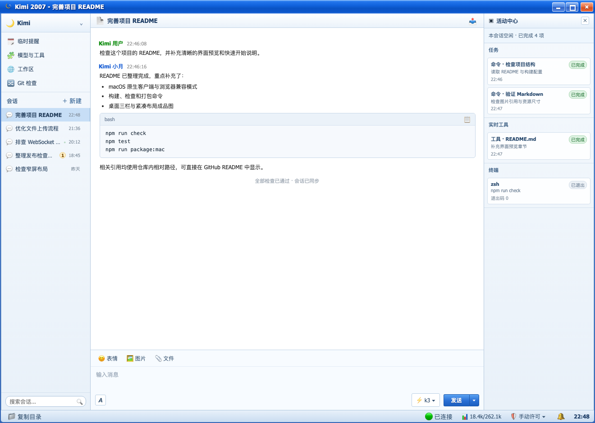
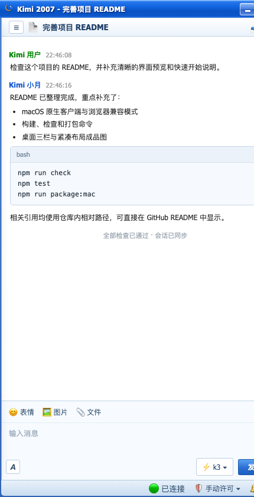

# Kimi 2007

Kimi 2007 是一个复古 QQ 2007 风格的 Kimi Code macOS 客户端。它使用 Swift、AppKit 和系统自带的 WKWebView 承载现有前端，不在应用包内放入 Electron、Chromium 或 Node.js 运行时。

当前版本为 `0.1.0`，提供 macOS arm64 构建。客户端连接本机单独安装的 `kimi server`，不包含 Kimi CLI 或模型服务。

## 界面预览

桌面端采用完整三栏布局，集中展示会话列表、Markdown 对话和当前会话的任务活动：



窗口变窄时自动切换为紧凑布局，左右栏收纳为抽屉，保留完整聊天与输入区域：

<p align="center">
  
</p>

## 使用前提

- macOS 12 或更高版本。
- 已安装并完成登录的 Kimi CLI。
- Kimi CLI 默认路径为 `~/.kimi-code/bin/kimi`；也可以通过 `KIMI_BIN` 指定路径。
- 编译原生客户端需要 Xcode Command Line Tools 或完整 Xcode。
- 只有浏览器兼容模式和 JavaScript 检查需要 Node.js 20 或更高版本。

客户端启动时会检查本机 `kimi server`。如果服务未运行，客户端会尝试执行 `kimi server run --keep-alive`。默认服务地址为 `http://127.0.0.1:58627`，可以通过 `KIMI_SERVER_PORT` 或 `KIMI_SERVER_BASE` 修改；令牌文件默认位于 `~/.kimi-code/server.token`，可以通过 `KIMI_SERVER_TOKEN_FILE` 修改。

## 多工作区

- 每个窗口绑定一个工作区。「文件」菜单的「新建窗口」（⌘N）和「新窗口打开工作区…」（⌘⇧N）可同时开多个窗口并行工作；左栏「工作区」面板每行的 ↗ 按钮也能把工作区开到新窗口。重启后自动恢复上次打开的窗口集合。
- 单窗口内也能纵览所有工作区：会话列表分组方式选「按工作区」，会话按工作区分节展示，点击分节头可切换到只看该工作区；工作区面板选择「全部工作区」时，会话条目会标注所属工作区。
- 浏览器兼容模式下，「新窗口打开」通过 `?cwd=<目录>` 新标签页实现（目录需真实存在）。

## 开发运行

启动 macOS 原生客户端：

```bash
npm start
```

这条命令会构建 release 版本的 `.app` 并打开它。也可以直接执行：

```bash
bash native/build.sh run
```

浏览器兼容模式：

```bash
npm run start:web
```

默认访问地址为 `http://127.0.0.1:2007`。浏览器模式使用 `tools/serve.js` 提供页面，并通过 `/env.json` 注入本机服务配置；原生客户端不提供这个 HTTP 接口，而是通过 WKWebView 原生桥接传递配置。

## 检查与打包

```bash
# 前端资源清单/组合后的 JavaScript 检查和 Swift debug 编译
npm run check

# 原生 WKWebView smoke test
npm test

# 只生成 .app
npm run package:mac

# 生成 .app、DMG 和 ZIP
npm run make:mac
```

构建产物位于 `out/`：

- `out/Kimi 2007-darwin-arm64/Kimi 2007.app`
- `out/make/Kimi 2007-0.1.0-arm64.dmg`
- `out/make/zip/darwin/arm64/Kimi 2007-darwin-arm64-0.1.0.zip`

`out/` 和 `native/.build/` 已加入 `.gitignore`。Swift 增量缓存不会进入分发包；需要清理时执行：

```bash
swift package --package-path native clean
```

## 客户端结构

- `native/Sources/Kimi2007/App/`：应用生命周期、多窗口、工作区持久化和冒烟测试；`Runtime/` 负责 Kimi 服务检测；`Web/` 负责 WKWebView 桥接和本地页面服务。
- `web/app/`、`web/styles/`：按职责拆分的前端 JavaScript/CSS 源片段；`web/static-manifest.json` 定义仅可访问的静态路由及虚拟 `/app.js`、`/style.css` 的组合顺序；`runtime/`、`vendor/`、`assets/` 存放启动器、第三方库和图片。
- `tools/serve.js`：浏览器兼容模式的本地 HTTP 服务和运行配置注入；`tools/web-assets.js` 负责校验并交付受控资源清单。
- `docs/`：本地过程记录（`DESKTOP.md` 原生客户端说明、`todolist.md` 在途工作）。
- `native/build.sh`：原生 `.app`、DMG 和 ZIP 的构建脚本。
- `native/smoke.sh`：原生 WKWebView 端到端 smoke test，由 `npm test` 调用。

原生客户端的页面服务只绑定本机回环地址，并且只提供 `web/static-manifest.json` 白名单中的前端路由；源片段与清单自身不会直接暴露。工作区保存在 macOS `UserDefaults`，不会写入项目源码目录。原生客户端页面中的外部 HTTP(S) 链接交给系统浏览器打开，应用页面不能导航到其他来源。

## 发布说明

当前构建使用 ad-hoc 签名，只适合本机或内部验证。对外发布前还需要：

- Apple Developer 的 Developer ID Application 签名。
- Apple notarization 公证并将票据 stapling 到应用或安装包。
- 自动更新和正式发布流水线（当前尚未接入）。

因此，当前产物可以用于本机验证，但不能作为消除 Gatekeeper 提示的公开 macOS 安装包。

## 运行边界

Kimi 2007 只负责客户端窗口、页面和本机 Kimi 服务连接。Kimi CLI 的登录状态、服务令牌、模型调用和实际任务执行仍由本机 Kimi 环境负责。
